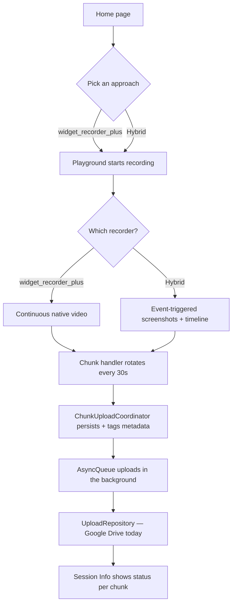
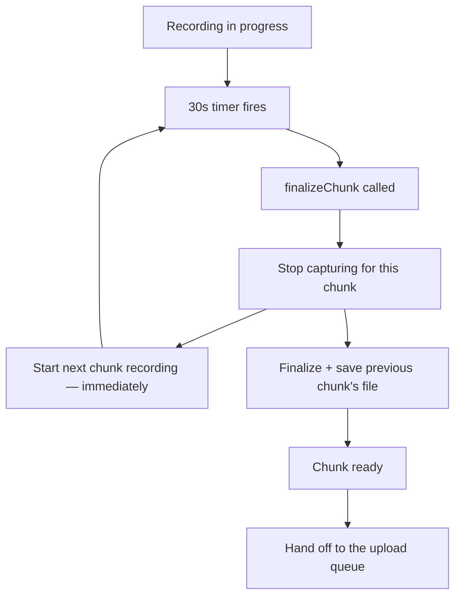
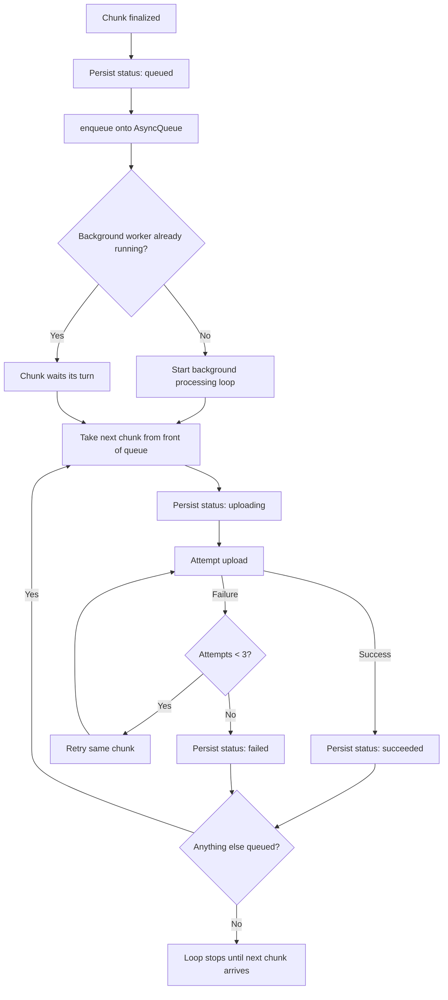
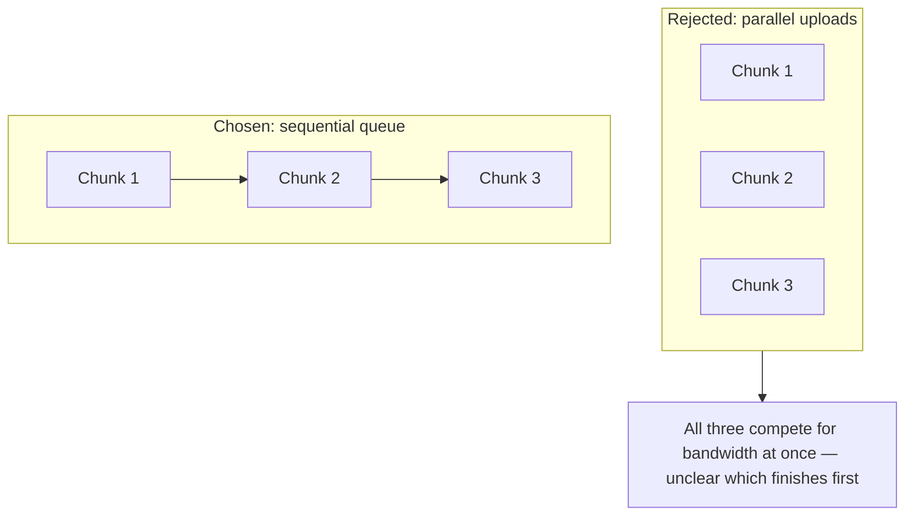
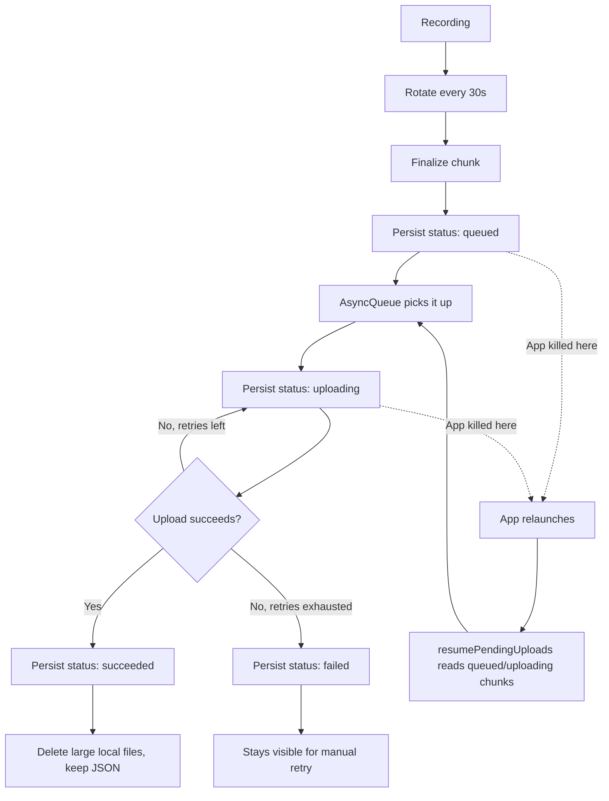
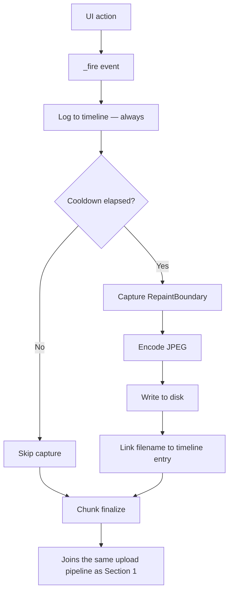
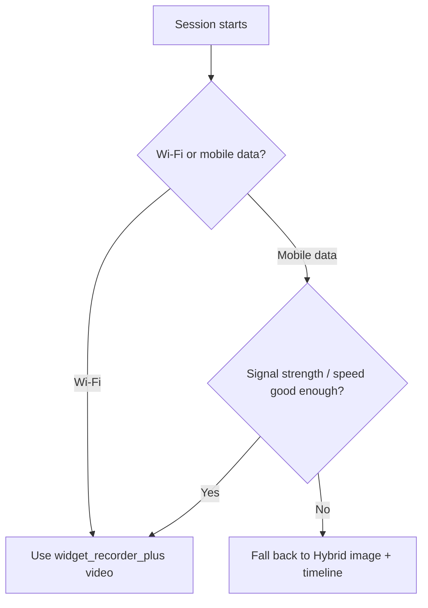

# SessionRecorderPlus

Flutter widget-recording comparison app. See `recordingRequirement.md` for the original problem statement and `recorderPlan.md` for the implementation plan and ranking table.

## Project Structure

The project follows a feature-first architecture with a separation between
presentation, domain, and data layers.

```
lib
├── core
│   ├── constants
│   │   └── app_strings.dart
│   ├── di
│   │   └── injection.dart
│   ├── routing
│   │   └── app_router.dart
│   ├── services
│   │   ├── async_queue.dart
│   │   └── async_upload_queue.dart
│   ├── theme
│   │   └── app_theme.dart
│   └── widgets
│       ├── duration_chip.dart
│       ├── expand_chevron.dart
│       └── pill_chip.dart
├── features
│   └── recording
│       ├── data
│       │   ├── recorder
│       │   │   ├── clarity
│       │   │   │   └── clarity_recorder_impl.dart
│       │   │   ├── hybrid
│       │   │   │   ├── hybrid_recorder_impl.dart
│       │   │   │   ├── screenshot_capture.dart
│       │   │   │   └── session_timeline.dart
│       │   │   └── widget_recorder_plus
│       │   │       └── widget_recorder_plus_impl.dart
│       │   ├── session_info
│       │   │   └── session_chunk_store.dart
│       │   └── upload
│       │       └── google_drive_upload_repository_impl.dart
│       ├── domain
│       │   ├── entities
│       │   │   ├── recorder_choice.dart
│       │   │   ├── recorder_event.dart
│       │   │   ├── recording_session_result.dart
│       │   │   ├── session_chunk.dart
│       │   │   ├── session_metrics.dart
│       │   │   └── upload_status.dart
│       │   ├── repository
│       │   │   ├── session_chunk_repository.dart
│       │   │   ├── session_recorder.dart
│       │   │   └── upload_repository.dart
│       │   └── usecase
│       │       └── chunk_upload_coordinator.dart
│       └── presentation
│           ├── controller
│           │   ├── playground_controller.dart
│           │   └── session_timer.dart
│           ├── home
│           │   ├── components
│           │   │   └── recorder_choice_card.dart
│           │   └── home_page.dart
│           ├── playground
│           │   ├── components
│           │   │   └── playground_header.dart
│           │   ├── item_detail_page.dart
│           │   └── playground_page.dart
│           ├── session_info
│           │   ├── components
│           │   │   ├── approach_filter_bar.dart
│           │   │   ├── chunk_status_chip.dart
│           │   │   └── chunk_tile.dart
│           │   └── session_info_page.dart
│           ├── session_summary
│           │   ├── components
│           │   │   └── remote_inspection_card.dart
│           │   └── session_summary_page.dart
│           └── shared
│               ├── artifact_tile.dart
│               ├── format_utils.dart
│               ├── session_metrics_details.dart
│               └── stat_tile.dart
└── main.dart
```

```
┌─────────────────────────────────────────────┐
│                Presentation                 │
│                                             │
│  Pages → Components → Controllers           │
└──────────────────────┬──────────────────────┘
                       │
                       ▼
┌─────────────────────────────────────────────┐
│                   Domain                    │
│                                             │
│  Entities → Use Cases → Repository Contracts│
└──────────────────────┬──────────────────────┘
                       │
                       ▼
┌─────────────────────────────────────────────┐
│                    Data                     │
│                                             │
│  Recorder Implementations → Storage → Upload│
└─────────────────────────────────────────────┘
                       │
                       ▼
┌─────────────────────────────────────────────┐
│                    Core                     │
│                                             │
│  DI → Routing → Services → Theme → Widgets  │
└─────────────────────────────────────────────┘
```

---

## How the recording & upload pipeline works

This report covers the two custom-built recording approaches in `SessionRecorderPlus`: **`widget_recorder_plus`**, paired with a from-scratch chunked upload pipeline, and **Hybrid**, a lightweight event-triggered screenshot + timeline tracker. Both solve the same underlying problem — capturing a user's session indefinitely, without a manual stop, in a way that's safe to upload — using very different capture strategies.

### Big picture



Both recorders feed the exact same downstream pipeline — chunking, metadata, queueing, and upload are shared, untouched by which capture method produced the chunk. The sections below walk through each stage in detail.

### 1. `widget_recorder_plus` + the chunked upload pipeline

#### 1.1 Why `widget_recorder_plus`

The package gives native H.264 video encoding via platform channels (`WidgetRecorderController` on the Dart side, driving `AVAssetWriter`/`MediaCodec` natively) wrapped behind a `WidgetRecorder` widget. That means no manual frame-compositing or software encoding on our side — the visual fidelity and performance come from the platform's own video pipeline, not a Dart re-implementation of one.

#### 1.2 The core risk: one giant upload after a long, continuous recording

There's no manual "start/stop" button in this app — recording is meant to run indefinitely, capturing a full session. A naive design — record continuously, upload once at the end — has three real failure modes:

- **A huge payload.** A long session's video can run into tens or hundreds of megabytes, all sitting in memory or on disk until the very end.
- **All-or-nothing upload risk.** One upload attempt for the entire session means one network hiccup loses the *whole thing*, not a fraction of it.
- **Zero partial progress.** If the app is killed mid-recording — backgrounded and evicted, crashed, force-quit — nothing has been saved anywhere. The whole session is gone.

This is the problem the rest of Section 1 solves: turn one unbounded recording into a stream of small, independently safe units.

#### 1.3 The chunk handler — how we made an unstoppable recording finite

Video encoders (and, as covered in Section 2, JPEG screenshot sequences) both need to be *finalized* into a real file at some point — you can't upload "a recording that's still going." Our answer is a repeating timer that finalizes the current chunk every 30 seconds and immediately restarts a brand-new one. From the user's perspective, recording is one continuous session; underneath, it's actually a stream of independent, self-contained, individually-uploadable chunks.

```dart
Future<void> _rotateChunk() async {
  final shouldSkipRotation = _ended || _rotating;
  if (shouldSkipRotation) return;
  _rotating = true;
  try {
    final chunkResult = await recorder.finalizeChunk();
    unawaited(
      chunkUploadCoordinator.enqueueNewChunk(
        chunkResult,
        screenName: screenName,
        indexValue: _chunkIndex++,
      ),
    );
  } finally {
    _rotating = false;
  }
}
```

The subtlety that makes this actually work is inside `finalizeChunk()` itself: the next chunk starts recording *before* the previous chunk's file has even finished being written to disk. Finalizing a native video file isn't instant — if we'd waited for that confirmation before restarting, every single chunk boundary would silently drop however long that finalization takes.

```dart
@override
Future<RecordingSessionResult> finalizeChunk() async {
  final startedAt = _startedAt ?? DateTime.now();
  final completion = Completer<String?>();
  _completion = completion;

  unawaited(_controller.stop().catchError((_) => null));
  final endedAt = DateTime.now();

  _startedAt = DateTime.now();
  await _controller.start();

  final path = await _awaitSavedPath(completion);
  return _buildResult(startedAt: startedAt, endedAt: endedAt, path: path);
}
```



#### 1.4 `AsyncQueue` — everything upload-related happens in the background

Chunking alone just produces a steady stream of small files. Without a resilient way to get them off the device, a slow or dropped connection would still mean lost data. `AsyncQueue` (the abstract contract) and its implementation `AsyncUploadQueue` are what make recording completely indifferent to network conditions — a background worker, entirely separate from the chunk-rotation timer in 1.3. Recording never waits on it, never checks its progress, and is never slowed down by it.

```dart
abstract class AsyncQueue {
  void enqueue(Future<void> Function() operation);
}
```

```dart
class AsyncUploadQueue implements AsyncQueue {
  AsyncUploadQueue({this.onQueueEmpty});

  final void Function()? onQueueEmpty;
  final List<_QueueItem> _queue = [];
  bool _processing = false;

  @override
  void enqueue(Future<void> Function() operation) {
    _queue.add(_QueueItem(operation));
    if (!_processing) _process();
  }

  Future<void> _process() async {
    _processing = true;
    while (_queue.isNotEmpty) {
      final item = _queue.first;
      try {
        await item.operation();
        _queue.removeAt(0);
      } catch (e) {
        item.attempts++;
        if (item.attempts >= _QueueItem.maxAttempts) {
          debugPrint('[AsyncUploadQueue] Dropped after ${_QueueItem.maxAttempts} attempts: $e');
          _queue.removeAt(0);
        }
      }
    }
    _processing = false;
    onQueueEmpty?.call();
  }
}
```

Everything upload-related — persisting a chunk's status, attempting the upload, retrying up to 3 times on failure, marking it succeeded or failed, cleaning up afterward — runs on this background path, off to the side of the recording pipeline. The chunk-rotation timer just keeps producing a new chunk every 30 seconds regardless of what this loop is doing at that moment: draining instantly, mid-retry on a flaky connection, or backed up with several chunks waiting.



Everything in this diagram runs in the background — meanwhile, the chunk-rotation timer from 1.3 keeps firing every 30 seconds completely independently of where this loop currently is.

**Sequential, not parallel, on purpose.** It matches the natural one-chunk-per-30s cadence, avoids several chunk uploads competing for bandwidth at once, and keeps "which chunk finished uploading first" simple to reason about.



#### 1.5 If the user closes the app mid-upload — resuming on next open

The key idea: the on-device chunk record *is* the durable pending queue. There's no separate queue-state file — every chunk is persisted with a status (`queued`/`uploading`/`succeeded`/`failed`) *before* it's even handed to `AsyncUploadQueue`. A killed app only loses the in-memory queue, never the record of what still needs uploading.

```dart
Future<void> resumePendingUploads() async {
  await sessionChunkStore.ensureLoaded();
  final pending = sessionChunkStore.chunks.value.where(
    (c) => c.status.isQueued || c.status.isUploading,
  );
  for (final chunk in pending) {
    retry(chunk);
  }
}
```

This runs once from `main()` at startup, unawaited so it never blocks the first frame:

```dart
Future<void> _init() async {
  WidgetsFlutterBinding.ensureInitialized();
  _setupErrorHandlers();
  setupInjection();
  unawaited(getIt<ChunkUploadCoordinator>().resumePendingUploads());
  runApp(/* ... */);
}
```

#### 1.6 The chunk-ordering problem — how the server knows what comes after what

Chunks upload independently through a sequential queue, but they still need to be reassembled into one continuous recording server-side, and chunks can arrive out of order. The fix is a small metadata payload that travels with every chunk:

```dart
Map<String, dynamic> _metadataMap({
  required String id,
  required String screenName,
  required int indexValue,
  required DateTime capturedAt,
  required String approachName,
  required int durationMs,
}) {
  return {
    ChunkMetadataKeys.chunkId: id,
    ChunkMetadataKeys.screen: screenName,
    ChunkMetadataKeys.approach: approachName,
    ChunkMetadataKeys.capturedAt: capturedAt.toIso8601String(),
    ChunkMetadataKeys.index: indexValue,
    ChunkMetadataKeys.durationMs: durationMs,
  };
}
```

`index` — assigned locally by `PlaygroundController` as each chunk is produced, not derived from upload or arrival time — is the authoritative sequence number. It's attached both as the upload's own description field (atomic with the upload itself, not a sidecar that could go missing) and as a file bundled inside the chunk's own archive:

```dart
String _ddmmyyyy(DateTime d) {
  final dd = d.day.toString().padLeft(2, '0');
  final mm = d.month.toString().padLeft(2, '0');
  final yyyy = d.year.toString().padLeft(4, '0');
  return '$dd$mm$yyyy';
}

String _remoteNamePrefix(SessionChunk chunk) {
  return '${_ddmmyyyy(chunk.capturedAt)}_${chunk.id}_${chunk.indexValue}';
}
```

This filename convention, plus a per-day subfolder grouping, gives a second, human-eyeballable ordering layer on top of the metadata itself.

#### 1.7 Post-upload local cleanup

Once the upload backend confirms a chunk, its large binaries (video or screenshots) and the archive built from them are deleted to stop on-device storage from growing unbounded over a long-running app. The small JSON artifacts are deliberately kept, so the app's own UI can still show them even after the chunk has succeeded.

```dart
Future<void> _deleteLocalFiles(
  SessionChunk chunk,
  UploadRequest uploadRequest,
) async {
  for (final artifact in chunk.localArtifacts) {
    if (artifact.kind == ArtifactKind.timelineJson) continue;
    final file = File(artifact.path);
    if (await file.exists()) await file.delete();
  }
  final zipFile = File(uploadRequest.artifact.path);
  if (await zipFile.exists()) await zipFile.delete();
}
```

Failed chunks are left untouched entirely — a retry needs the original files to rebuild the archive.

#### End-to-end: the full chunk lifecycle



### 2. Hybrid — event-triggered screenshots + timeline

#### 2.1 What "session events" are, and how the app knows when to trigger them

A small enum of semantic events — not raw pointer or frame noise:

```dart
enum RecorderEventType {
  screenEnter,
  screenExit,
  tap,
  longPress,
  significantScroll,
  navigation,
  dialogOpen,
  dialogClose,
  bottomSheetOpen,
  bottomSheetClose,
  textInputCompleted,
  loadingStart,
  loadingEnd,
  error,
  uiStateChanged,
}
```

Instrumentation lives in the UI layer, not the recorder itself — the recorder only reacts to events it's handed, it doesn't discover them on its own:

```dart
void onScrollDelta(double delta, double pixels) {
  _scrollSinceLastFire += delta.abs();
  if (_scrollSinceLastFire < kSignificantScrollThresholdPx) return;
  final firedDelta = _scrollSinceLastFire.round();
  _scrollSinceLastFire = 0;
  _fire(
    RecorderEventType.significantScroll,
    data: {'offset': pixels.round(), 'delta': firedDelta},
  );
}

void onCtaTap() {
  applied.value = !applied.value;
  _fire(RecorderEventType.tap, data: {'target': 'apply_button', 'applied': applied.value});
}

void _fire(RecorderEventType type, {Map<String, dynamic> data = const {}}) {
  if (_ended) return;
  recorder.recordEvent(RecorderEvent(type, DateTime.now(), data: data));
}
```

Each concrete UI action — a scroll past a threshold, a CTA tap, a dialog opening, entering the screen — fires its own named event through this same `_fire()` call.

#### 2.2 Capture policy — decoupled from event detection

Every event is *always* logged to the timeline. A screenshot is only actually captured if a cooldown (500ms default) has elapsed since the last one — what makes this "hybrid" rather than capture-on-every-notification:

```dart
@override
void recordEvent(RecorderEvent event) {
  final timeline = _timeline;
  final startedAt = _startedAt;
  final notRecording = timeline == null || startedAt == null || _stopped;
  if (notRecording) return;

  final elapsedSeconds = event.timestamp.difference(startedAt).inMilliseconds / 1000.0;

  final withinCooldown = _lastCaptureAt != null &&
      event.timestamp.difference(_lastCaptureAt!) < minCaptureInterval;

  if (withinCooldown) {
    timeline.addEntry(TimelineEntry(timestampSeconds: elapsedSeconds, type: event.type, data: event.data));
    return;
  }

  _lastCaptureAt = event.timestamp;
  final frameFileName = timeline.allocateFrameFileName();
  _pendingCapture = _captureAndAppend(timeline, frameFileName, elapsedSeconds, event);
}
```

A burst of scroll notifications, for example, still logs every single event — it just doesn't spam a screenshot for each one.

#### 2.3 How capture actually works with `RenderRepaintBoundary`

```
function captureScreenshot(boundary):
    image = null
    retry up to 3 times:
        try: image = boundary.toImage()
             stop retrying
        on failure: wait ~32ms, try again

    if image is null:
        return nothing captured

    pixels = image.readRawPixels()
    jpegBytes = encodeToJpeg(pixels, quality: 80)
    writeToDisk(jpegBytes)
    return jpegBytes.size
```

A `RepaintBoundary` wraps the captured content; on a qualifying event, this reads back the current frame as raw pixels, encodes it to JPEG (quality ~80), and writes it straight to disk — never buffered as a growing in-memory list. The retry loop exists because `toImage()` can be called mid-repaint and fail transiently; a short wait and another attempt is simpler and more robust than trying to key off scheduler state directly.

#### 2.4 Timeline + metadata, and how a server could run AI analysis over it

```dart
class TimelineEntry {
  const TimelineEntry({
    required this.timestampSeconds,
    required this.type,
    this.screenshotRelativePath,
    this.data = const {},
  });

  final double timestampSeconds;
  final RecorderEventType type;
  final String? screenshotRelativePath;
  final Map<String, dynamic> data;

  Map<String, dynamic> toJson() => {
    'timestamp': timestampSeconds,
    'type': type.wireName,
    if (screenshotRelativePath != null) 'screenshot': screenshotRelativePath,
    ...data,
  };
}
```

Each event links to its screenshot filename (if one was captured) via elapsed-seconds timestamps rather than absolute clock time — deliberately relative, so a chunk's timeline is self-contained regardless of when it actually ran.

This is what makes AI analysis practical: a chronologically-ordered, pre-labeled event+screenshot log answers "what was on screen when the user did X" directly. It's cheaper to transmit and process than full video, and it's already semantically classified — a `tap` event doesn't need a model to infer it from pixels the way a video frame would; the event type is already known at capture time.

The same per-chunk metadata/archive bundling from Section 1 applies here too, via the same `ChunkUploadCoordinator` — the timeline's own file (`session_timeline.json`) is kept distinctly named from the chunk-identity `metadata.json`. An earlier version of both used the same filename, which made two different JSON artifacts show up indistinguishably in the app's own UI; the rename resolved it.



### 3. Future enhancements

#### 3.1 Proposed idea: switch approach based on network quality

Both approaches share the same chunking/upload/metadata pipeline — only the *capture* method differs. That means a network-aware switch between them is a capture-layer decision, not a rebuild: on Wi-Fi, record video; on mobile data, check signal strength/speed first — good enough, still record video; otherwise fall back to the Hybrid image+timeline method, which produces far less data per unit of user activity and tolerates a weak connection much better.



#### 3.2 What this proposal would need — what Flutter gives you vs. what's extra

| Capability | Built into Flutter? | What it'd take |
|---|---|---|
| Detect Wi-Fi vs. mobile | No | `connectivity_plus` package |
| Detect connectivity changes live | No | `connectivity_plus` package |
| Confirm the internet actually works (not just "connected") | No | A small network request of our own |
| Mobile signal strength | No | Native Android/iOS APIs or a plugin |
| Network type (4G/5G/LTE) | No | Native APIs or a plugin |
| Actual upload/download speed | No | A small speed-test implementation of our own |
| Save video/screenshots locally | Yes | Dart/Flutter file APIs |
| Build the chunk's zip | Via a package | The `archive` package |
| Capture a widget as an image | Partially | `RepaintBoundary` |
| Upload in the background, off the recording path | Partially | `AsyncQueue` (Section 1.4) |

The network-quality signal is the only new piece this idea needs — a small, self-contained addition that wouldn't touch the chunking, queueing, or upload logic at all.

### 4. Google Drive today, anything tomorrow

The upload backend is Google Drive today, but the pipeline never talks to Drive directly — it depends only on `UploadRepository`, an abstract interface. The high-level policy (chunking, queueing, retries, resume-on-relaunch, chunk ordering) doesn't depend on the low-level detail (Google Drive's API); both depend on the same abstraction instead. `GoogleDriveUploadRepositoryImpl` is just one interchangeable implementation of that interface, not something the rest of the pipeline knows or cares about.

Swapping in a real server or S3 means writing a new implementation of that same interface — the dependency still points inward, toward the abstraction, never back out toward a concrete backend. Nothing above it changes: chunking, the queue, retries, resume-on-relaunch, and chunk ordering all stay exactly as they are.
